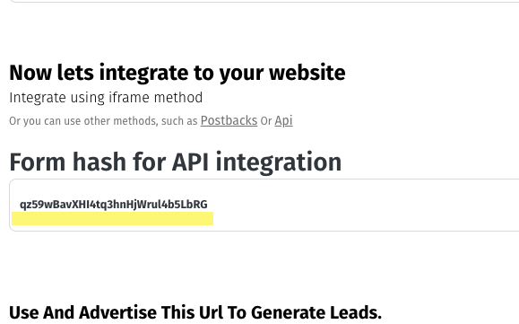
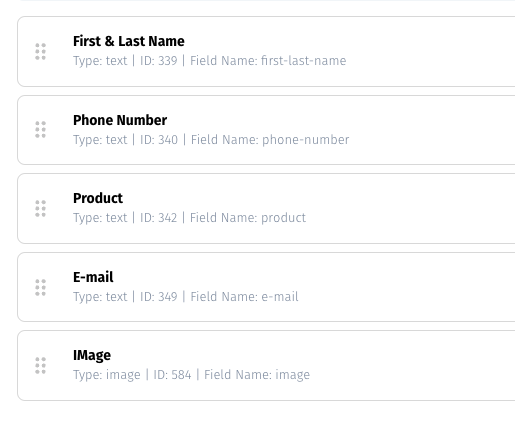

# Using CRM API

MyDataNinja Offers simple and intuitive API to create and track leads in our Built-in simple CRM

### What you need to send lead via API?

In order to send lead via API, you will need **Unique form hash** and **field names** to identify to which form and fields you are sending data.

#### How to get form hash?

- To get form hash, you have to navigate to Integration step in your form configuration and find there form hash
  

#### How to get form field names?

- To get field names, navigate to fields step in form configuration and there you can see field names
  

---

### Using javascript SDK

First of all you have to [integrate our javascript snippet](../integration/create-js-snippet) in your website, then you will have access to `nj` global variable.

Here is the example snippet to create lead using javascript API:

```js
nj.form
  .fill('<FORM_HASH>')
  .setField('full-name', 'John Doe')
  .setField('phone-number', '+198237465656')
  .setField('e-mail', 'john@email.com')
  .submit();
```

:::info
If everything goes well, `submit` method will return `Promise` which resolves with following parameters:

```js
{
  success: true,
  lead_id: 12345678
}
```

:::

---

### Using REST Api

If you want to send data with REST API, you can see following example below:

```js
fetch('https://collect.mydataninja.com/crm/lead', {
  headers: {
    accept: 'application/json',
  },
  body: JSON.stringify({
    agent:
      'Mozilla/5.0 (Macintosh; Intel Mac OS X 10_15_7) AppleWebKit/537.36 (KHTML, like Gecko) Chrome/120.0.0.0 Safari/537.36',
    form_id: 'qz59wBavXHI4tq3hnHjWrul4b5LbRG',
    values: {
      'full-name': 'John Doe',
      'phone-number': '+12345568449',
      'e-mail': 'john@mail.com',
    },
    njid: '<NJ_ID>',
    njuser: '<NJ_USER>',
    event_id: '<NJ_EVENT_ID>',
  }),
  method: 'POST',
});
```

:::warning
For tracking purposes, it's necessary to give us `NJ_ID`, `NJ_USER` OR `NJ_EVENT_ID` parameters in REST API call. If you want to know how to get these paramters please visit [this page](../integration/start-tracking)
:::

:::info
If everything goes well, you will get following response

```js
{
  success: true,
  lead_id: 12345678
}
```

:::
