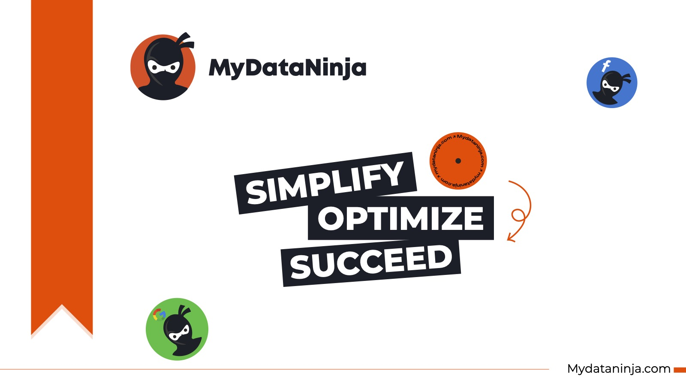

# Tutorial Intro

## MyDataNinja.com - Simplify, Optimize, Succeed

### 

The core idea behind MyDataNinja’s creation is to empower companies by consolidating all essential functionalities into a single platform specifically designed for advertising needs. MyDataNinja streamlines the management of multiple advertising accounts, enhancing the efficiency of digital advertising through automation and real-time data analysis, enabling faster and more informed decision-making processes.

The significance of real-time data in advertising cannot be overstated. Many companies currently handle this task manually, typically on a weekly basis (in an optimal scenario), resulting in data inaccuracies, delayed information, and consequently, delayed decisions. MyDataNinja easily resolves these challenges. It provides instantaneous information on each advertisement’s profitability, precise ROI, and revenue, enabling swift identification and deactivation of underperforming ads. This not only optimizes budget spending but also has the potential to double or more the results by reallocating funds to high-performing advertisements... [continue reading](https://mydataninja.com/set-up-mydataninja/)
