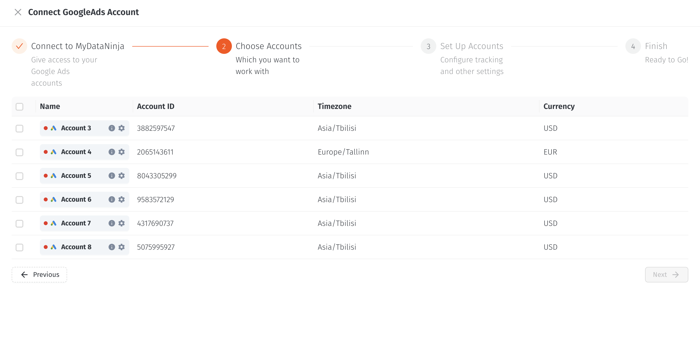
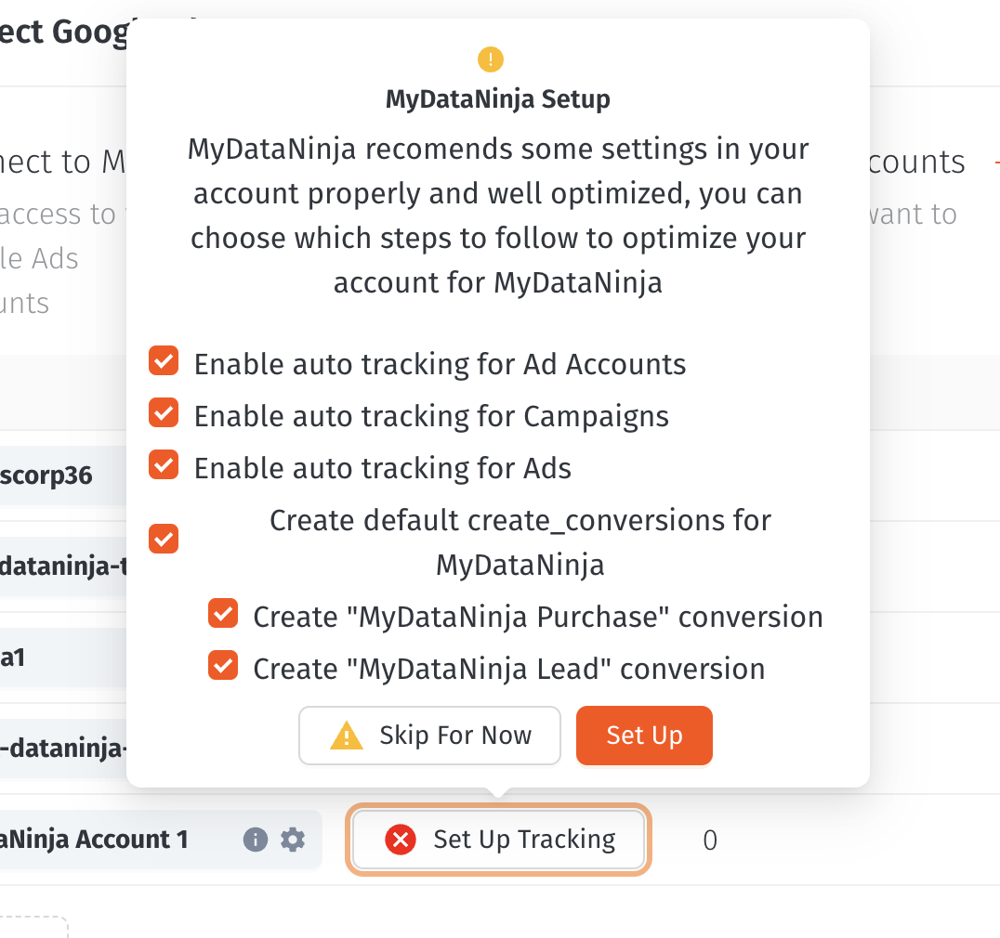

### How to enable tracking on Google Ads ?

MyDataNinja has completely automated Google Ads tracking and requires only a few click to enable.

##### 1. Open MyDataNinja account and go click on "Marketing Channels" on your sidebar

##### 2. Choose Google ads and connect the accounts where you want to enable tracking

Screenshot

##### 3. After connection choose accounts and go to "Set Up Accounts" step

##### 4. If Click on the setup Button and check "Enable auto tracking" checkboxes

Screenshot

##### 5. Setting up may take a few minutes and you will get notified when it's done.
