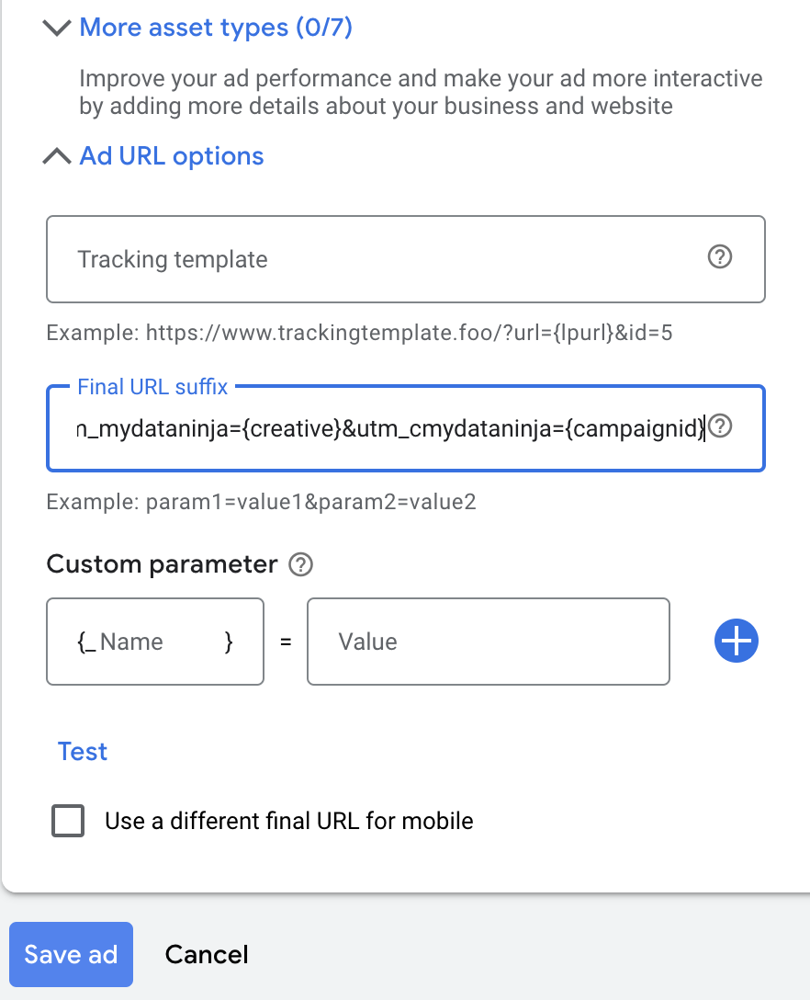

### How to enable tracking on Google Ads ?

MyDataNinja has completely automated Google Ads tracking and requires only a few click to enable.

##### 1. Open MyDataNinja account and go click on "Marketing Channels" on your sidebar

##### 2. Choose Google ads and connect the accounts where you want to enable tracking

Screenshot

##### 3. After connection choose accounts and go to "Set Up Accounts" step

##### 4. If Click on the setup Button and check "Enable auto tracking" checkboxes

Screenshot

##### 5. Setting up may take a few minutes and you will get notified when it's done.

### Which ads will be tracked automatically?

When you request automatic setup, MyDataNinja will track every Campaigns and Ads which is active at that exact time.
For future ads MyDataNinja will remember your choice that you want auto tracking and will track newly created ads till you disconnect account from MyDataNinja

### How Google Ads Tracking work behind the scenes?

During Tracking setup process, MyDataNinja adds `utm_mydataninja` and `utm_cmydataninja` parameters on 3 different levels to ensure that tracking works properly.

- Account level
- Campaign level
- Ad level

`utm_mydataninja` and `utm_cmydataninja` are added to Final url suffix on each level and is expected to be replaced via Creative ID and Campaign ID respectively. See more about google dynamic parameters [here](https://support.google.com/google-ads/answer/6305348)

When setup is properly done you should see `utm_mydataninja={creative}&utm_cmydataninja={campaignid}` parameters on the assets mentioned above. See example screenshot below:

Screenshot

#### How to set up tracking manually for only some ads?

Since you already know how tracking works behind the scenes you can do it manually if you prefer.
You have just these parameters `utm_mydataninja={creative}&utm_cmydataninja={campaignid}` to put in Final Url Suffix on the levels you want to track.

#### What is utm_cmydataninja parameter?

As already mentioned `utm_cmydataninja` represents Campaign ID of the ad which user has clicked. Campaign ID is used to track the ads that doesn't have creative which are Usually Performance Max and Shopping Ads Campaigns.

It's also worth mentioning that in MyDataNinja Report you will see reports on Campaign level in these type of campaigns, since the doesn't have Creative or Ad leve like others.
