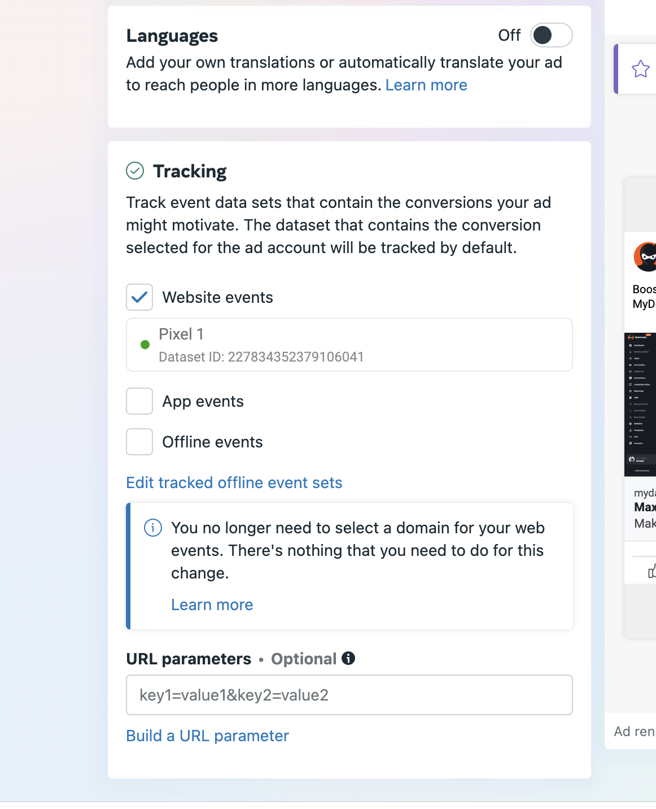
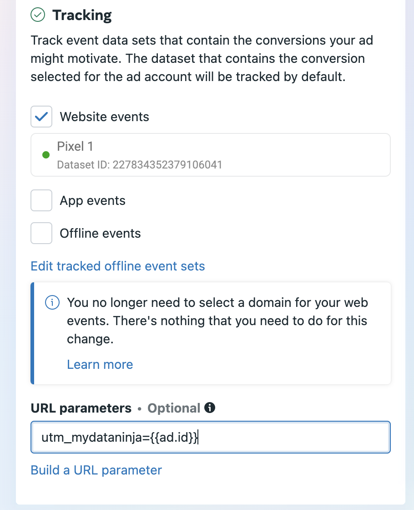
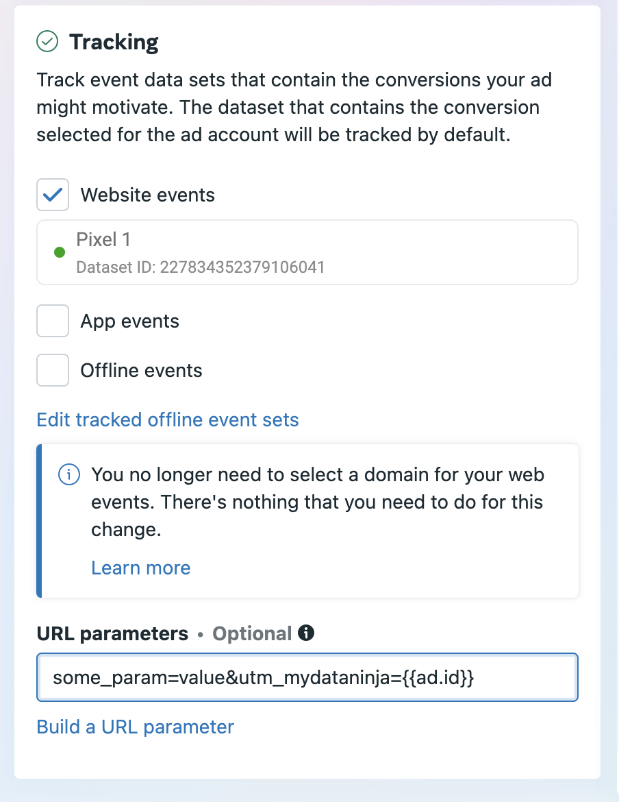

Because of api limitations **Meta Ads** requires by far the most manual work to set up tracking via [**UTM parameters**](./how-mydataninja-tracking-works)

We're working to reduce the manual work as much as we can, but now, you have to add `UTM` parameters manually to every running ads you have.

### How to add UTM parameters to Meta ads?

##### 1. Go to your Ads Manager and select the ad for which you want to enable tracking

##### 2. Click on Edit and scroll down to the field called: "URL parameters"

Screenshot

##### 3. If the field is empty copy `utm_mydataninja={{ad.id}}` there and click on "Publish" button.

Screenshot

##### 4. If the field is not empty and has other parameters in it add `utm_mydataninja={{ad.id}}` to the end with `&` separator

Screenshot

##### 5. Press the "Publish" button and wait for the review to be completed

### How long does it take to review the changes?

Ads typically goes back into the review process to ensure it complies with Meta's advertising policies. The review time can vary depending on several factors, but editing url parameters is considered as a minor change and it usually completed in a minutes but may take hours to complete. Read more about review process on this [link](https://transparency.meta.com/en-gb/policies/ad-standards/?)
